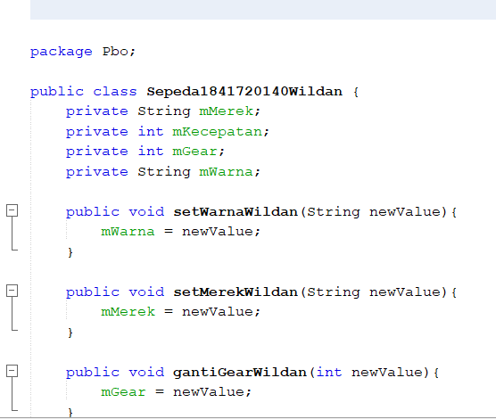
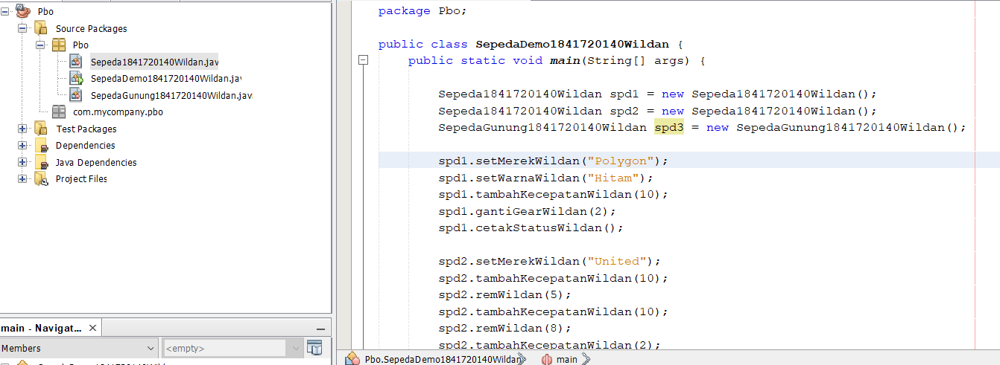
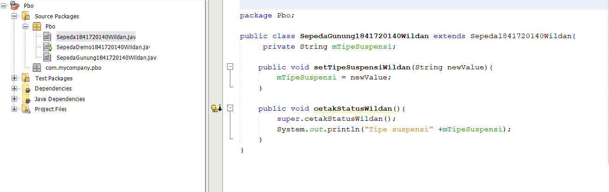
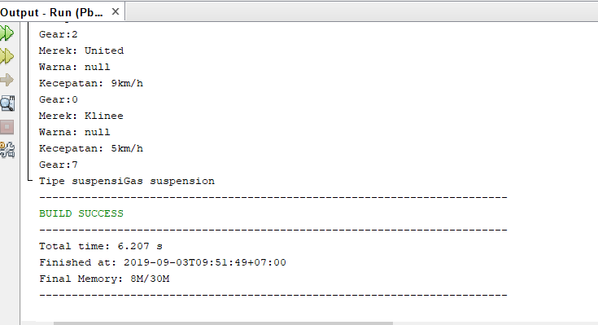
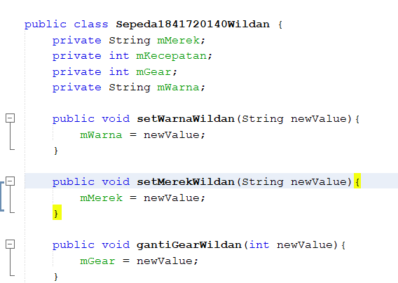
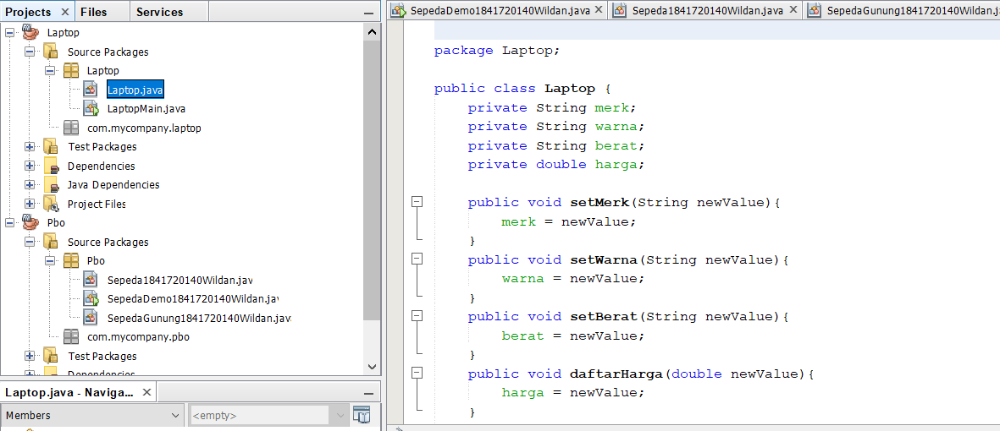
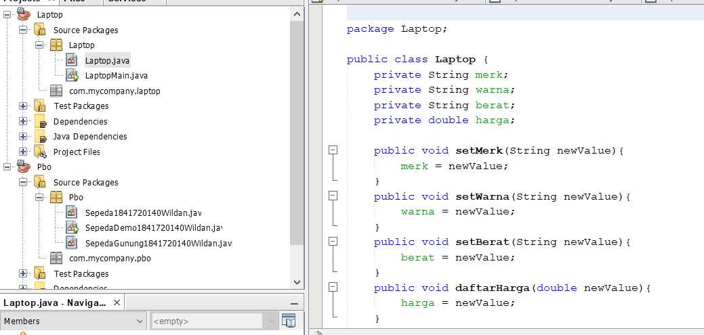
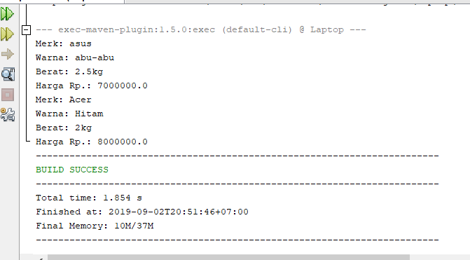

# Laporan Praktikum #1 - Pengantar Konsep PBO

## Kompetensi

1. Perbedaan paradigma berorientasi objek dengan paradigma struktural
2. Konsep dasar PBO

## Ringkasan Materi

susah untuk coding selalu error

## Percobaan

### Percobaan 1

(berisi penjelasan percobaan 1. Jika ada rujukan ke file program, bisa dibuat linknya di sini.)

`contoh screenshot yang benar, menampilkan 3 komponen, yaitu struktur project, kode program, dan hasil kompilasi`

Contoh link kode program : [ini contoh link ke kode program](../../src/Sepeda1841720140Wildan.java)
Contoh link kode program : [ini contoh link ke kode program](../../src/SepedaDemo1841720140Wildan.java)

### Percobaan 2

(berisi penjelasan percobaan 2. Jika ada rujukan ke file program, bisa dibuat linknya di sini.)

`contoh screenshot yang benar, menampilkan 3 komponen, yaitu struktur project, kode program, dan hasil kompilasi`

Contoh link kode program : [ini contoh link ke kode program](../../src/SepedaDemo1841720140Wildan.java)
Contoh link kode program : [ini contoh link ke kode program](../../src/SepedaGunung1841720140Wildan.java)

## Pertanyaan

1. Sebutkan dan jelaskan aspek-aspek yang ada pada pemrograman berorientasi objek!
2. Apa yang dimaksud dengan object dan apa bedanya dengan class?
3. Sebutkan salah satu kelebihan utama dari pemrograman berorientasi objek dibandingkan dengan pemrograman struktural!
4. Pada class Sepeda, terdapat state/atribut apa saja?
5. Tambahkan atribut warna pada class Sepeda.
6. Mengapa pada saat kita membuat class SepedaGunung, kita tidak perlu membuat class nya dari nol?

jawaban
1.object,class,enkapsulasi,inheritance,polimorfisme
Object adalah suatu rangkaian dalam program yang terdiri dari state dan behaviour. Object pada software dimodelkan sedemikian rupa sehingga mirip dengan objek yang ada di dunia nyata.
Class adalah blueprint atau prototype dari objek. Ambil contoh objek sepeda. Terdapat berbagai macam sepeda di dunia, dari berbagai merk dan model.
Disebut juga dengan information-hiding. Dalam berinteraksi dengan objek, seringkali kita tidak perlu mengetahui kompleksitas yang ada didalamnya. Contoh pada sepeda, ketika kita
mengganti gear pada sepeda, kita tinggal menekan tuas gear yang ada di grip setang sepeda saja. Kita tidak perlu mengetahui bagaimana cara gear berpindah secara teknis.
Disebut juga pewarisan. Inheritance memungkinkan kita untuk mengorganisir struktur program dengan natural. Inheritance juga memungkinkan kita untuk memperluas fungsionalitas program tanpa harus mengubah banyak bagian program.
Polimorfisme juga meniru sifat objek di dunia nyata, dimana sebuah objek dapat memiliki bentuk, atau menjelma menjadi bentuk-bentuk lain. Misalkan saja objek pesawat terbang. Objek ini dapat diwariskan menjadi pesawat jet dan pesawat baling-baling. Keduanya memiliki kemampuan untuk menambah kecepatan. Namun secara teknis, metode penambahan kecepatan antara pesawat jet dengan baling-baling tentu berbeda, karena masing-masing memiliki jenis mesin yang berbeda.
2.Object adalah suatu rangkaian dalam program yang terdiri dari state dan behaviour.Class adalah blueprint atau prototype dari objek.
3.Kelebihan PBO adalah program dapat lebih fleksibel dan modular, jika ada perubahan fitur, maka dapat dipastikan keseluruhan program tidak akan terganggu. Berbeda dengan struktural, perubahan sedikit fitur saja kemungkinan dapat mengganggu keseluruhan program.
4.atribut merk,atribut kecepatan,atribut gear
5.
6.karena pada class sepedaGunung terdapat komponen tambahan walaupun class sepedaGunung tersebut berasal dari class sepeda

## Tugas

(silakan kerjakan tugas di sini beserta `screenshot` hasil kompilasi program. Jika ada rujukan ke file program, bisa dibuat linknya di sini.)

`contoh screenshot yang benar, menampilkan 3 komponen, yaitu struktur project, kode program, dan hasil kompilasi`

Contoh link kode program : [ini contoh link ke kode program](../../src/Laptop.java)
Contoh link kode program : [ini contoh link ke kode program](../../src/LaptopMain.java)

## Kesimpulan

kita telah mendemonstrasikan bagaimana paradigma pemrograman berorientasi objek dan mengimplementasikannya kedalam program sederhana. Kita juga telah mendemonstrasikan salah satu fitur paling penting dari PBO yaitu inheritance, yaitu dalam hal membuat class SepedaGunung.
Kita ketahui bahwa SepedaGunung pada dasarnya adalah sama dengan Sepeda (memiliki gear, memiliki kecepatan, dapat menambah kecepatan, dapat mengerem, pindah gigi, dsb) namun ada fitur tambahan yaitu tipe suspensi. Maka kita tidak perlu membuat class SepedaGunung dari nol, kita extends atau wariskan saja dari class Sepeda, kemudian kita tinggal tambahkan fitur yang sebelumnya belum ada di class Sepeda. Inilah salah satu kelebihan PBO yang tidak ada di pemrograman struktural.

## Pernyataan Diri

Saya menyatakan isi tugas, kode program, dan laporan praktikum ini dibuat oleh saya sendiri. Saya tidak melakukan plagiasi, kecurangan, menyalin/menggandakan milik orang lain.

Jika saya melakukan plagiasi, kecurangan, atau melanggar hak kekayaan intelektual, saya siap untuk mendapat sanksi atau hukuman sesuai peraturan perundang-undangan yang berlaku.

Ttd,

MOCHAMAD WILDAN
